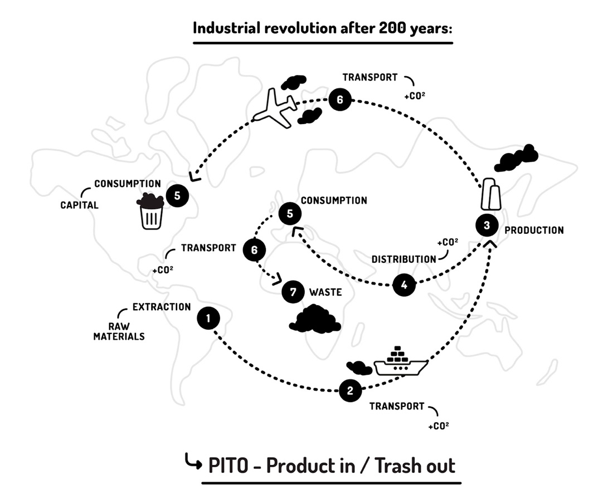
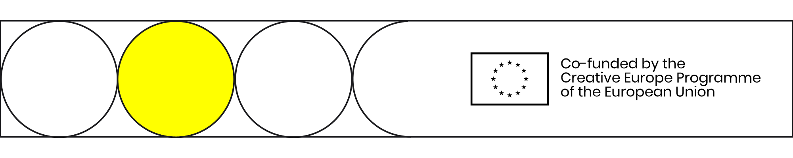

# 〰 Supply Chain of Me

## ​🎯**Invitation**

A Supply chain is the system that makes up the production of a product from raw material, manufacture to distribution.







This activity is to get to know you, what made you and how you work.



### To Do

Answer the questions in the circles and embellish with pictures and stories. Spread out beyond the page!

* RAW MATERIAL = where are you from?
* MANUFACTURE = what made you?&#x20;
* DISTRIBUTION = what drives you?
* FUEL = what motivates you?



&#x20;

## ✏Activity: Supply Chain of Me

Copy this Miro board into your own to fill it in



