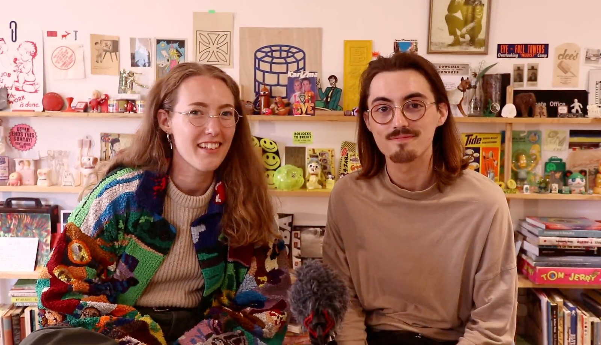

# 1. Batch.Works: An example of Distributed manufacture

## Contents

1. [Invitation](batch.works.md#invitation)
2. [Who are Batch Works?](batch.works.md#who-are-batch-works)
3. [Batch Basics](batch.works.md#batch-basics)
4. [Case Study: Batch.shield visor](batch.works.md#case-study-batch.shield-visor)
5. Exercise: Pen pot supply chains
6. [Podcast](batch.works.md#podcast)
7. [Resources](batch.works.md#resources)

## ​🎯Invitation

By understanding how Batch.works operates, you can start to comprehend supply chains. By doing an exercise comparing several objects manufactured in different ways, you will start to understand the complexity of supply chains and manufaature.

&#x20;Start by looking at the three tabs below.



## **♻️🛠 Who are Batch.works?**

Batch.works is a **3D design** and **manufacturing** studio based in East London. We use **digital manufacturing technology** to develop **sustainable alternatives** to current wasteful methods of mass manufacture

We are excited by small and thoughtful **material loops**. We understand that material flows from one state to the next and is **never waste.** Our digital manufacturing methods take material out of our current waste streams and turn it into meaningful objects that can have many further lives. We are currently working towards an in-house recycling facility to enable us to be in control of localised closed-loop production.&#x20;

Batch.works is demonstrating to larger incumbent design and manufacture businesses that making in this way is a viable alternative that makes commercial sense. In our current urban manufacturing facility we are able to produce runs of over 50,000 products made using recycled and recyclable material, catering for the needs of the city that surrounds us.


Batch.works website




In Distributed Design the way you communicate your project is as important as the product itself. Makers of our designs encounter them as instructions and recipes hosted and shared online.&#x20;

We want consumers/ citizens to choose Distributed Designs over mass-produced products. A strong graphic identity for the designer and brand for the product is key to this desirability.&#x20;

The purpose of this section of the toolkit is&#x20;

* To understand graphic identity
* To choose suitable fonts and colours
* To apply them to a manifesto that conveys your personal position



1. You need to have completed [Start with Why](../exercise-start-with-why.md) before this section
2. Read this section top to bottom first
3. Do the [Type Suitability activity](batch.works.md#type-suitability-activity)
4. Do the [Colour Palette activity](your-graphic-identity.md#colour-palette-activity)
5.  Do the [Manifesto activity](your-graphic-identity.md#making-your-manifesto)




## :package: Introduction

What are the core elements of Distributed Design?



A **supply chain** is a system of individuals, organisations or activities that together make up the production of a product or service from raw material to delivery. Understanding how supply chains work is key to unpicking the complex system of how things are made.



**Additive manufacture** is any process that forms material with little or no waste. This can be compared to subtractive manufacture where material is removed in order to form products or components. **3D printing is an additive process**



Using **digital manufacturing** tools like **3D printing** and **CNC Machining** it is possible to send digital files around the world and easily make objects locally. This reduces the need for lengthy global supply chains and makes it possible to keep track of material once it has left the factory.



**DFM/DFD Design for manufacture/Design for distribution **are core principles of Distributed Design. Ideas about how and where a product will be produced, used (and eventually reused and recycled) must be considered from the very beginning of the design process.&#x20;



When objects are made locally to their market using digital tools it is very easy to customise them. Traditional manufacture requires expensive set-up costs and tooling but with Distributed Design these upfront investments are minimal. This means that products can be tested with small production runs and little waste. Products can then easily be updated as areas for improvement are identified, and customised for different clients.



## :clipboard: Case Study: Batch.shield visor

The **Batch.shield visor** was designed in 2019 and distributed widely during the Coronavirus pandemic.&#x20;

**Supply Chain - **When Covid19 hit China, the rest of the world was left to fend for itself with no access to essential items. The global reliance on a centralised manufacturing hub and a single supply chain caused serious issues with the availability of much needed medical equipment. It quickly became apparent that there was not enough [PPE ](https://www.dictionary.com/browse/ppe)in the UK to keep up with demand.&#x20;

Batch.works worked with local hospitals to produce an efficient PPE mask that was delivered to the hospitals by cargo bike.&#x20;

**Additive -** 3D printing was the perfect process to make the core element of the Batch.Shield in a quick and efficient way. As the process is additive, there was no waste produced. Each part was made from 100% recycled PET.

## 🚚 ⛓Exercise: Pen Pot Supply Chains

This exercise is to help you start to understand supply chains. Using the Miro template below, look at each object and see if you can determine how and where each object is made, and start to build its supply chain.&#x20;


Needs to be redone


## 👂 Podcast


Needs to be checked


## :toolbox: Resources

You can use the resources below to explore alternatives to traditional supply chains




