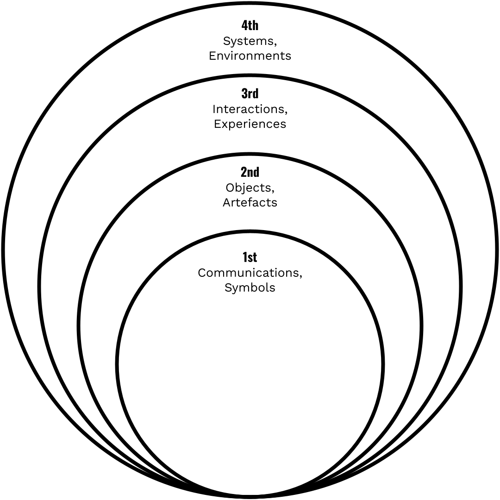
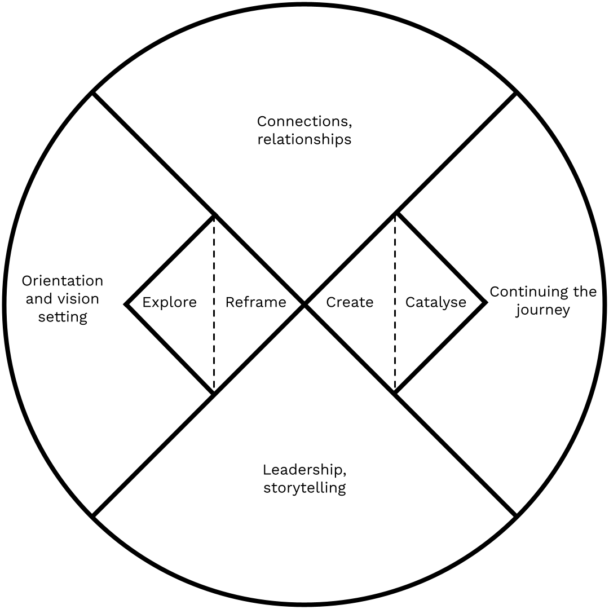
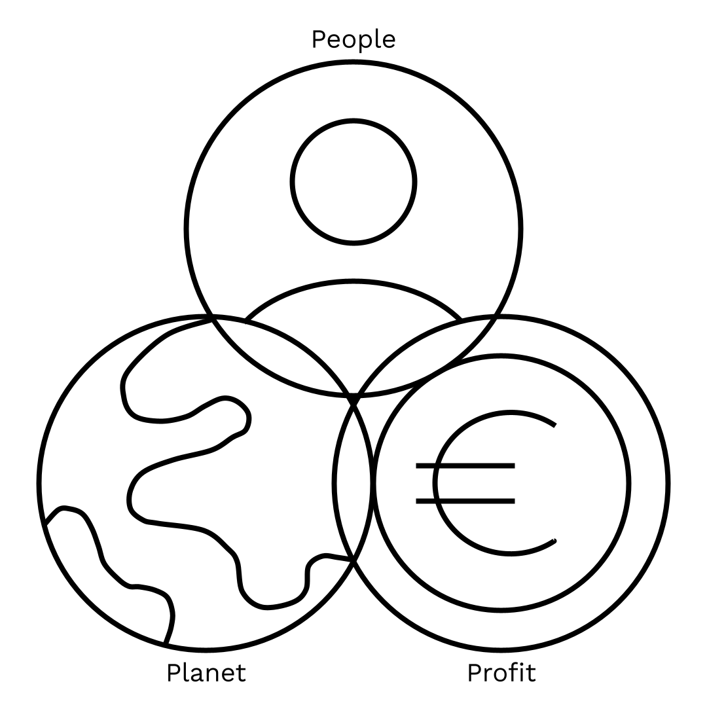
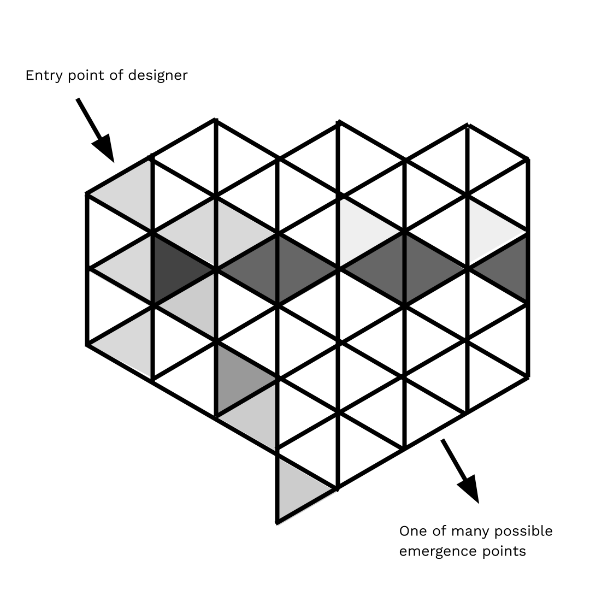

# Pedagogy (DELETE?)

### Introduction

As a platform member of DDMP since 2018, Other Today has experienced an increasing complexity in the understanding of Distributed Design as an approach.

Many of today’s leading design institutions are also changing their understanding of design’s role in society, for instance here in the UK, Design Council and The Royal Society of Arts have made significant changes to their communication of how design can contribute to our rapidly changing world.

We believe that systems thinking combined with hands-on making and engagement of citizens can create and support change.

### Increasing Complexities Within Design

Buchanan's Four Orders of Design (below) shows how the design profession covers a spectrum of complexity from the stylistic to the systemic.

In the past, students have begun their design learning journey with an initial degree at the simpler end of the spectrum, where they learn making skills. They might then move to the higher orders as they undertake further education or gain professional experience.

Our world is under so much pressure to change, with many governments in the world committing to reaching net zero within the next 30 years.

To teach design at a low complexity level is no longer tenable, it risks sending graduates into the world who have no understanding how their creations will affect interconnected ecosystems.

Figure 1, Buchanan's Four Orders of Design

### Other Today and Distributed Design

When we started working on this platform in 2018, we believed that in order for Distributed Design to make an impact, it needed to mature beyond the prevailing maker aesthetic we were familiar with from running maker spaces.

We gathered a group of talented designers who, through a collaboration with the lighting brand Tala, pushed the look and form of digitally fabricated products with a collection of distributable lamps.

In 2019 we began to question the business models that were possible within Distributed Design, and started to explore product-as-experience.

We took one lamp design and explored what it would take to put it into batch production, quickly realising that there was an opportunity to invite the purchaser of this lamp to participate in its making.

This participation was beneficial in many ways - it engaged the purchaser in the understanding of the parameters of the object, and created a narrative and business model.

_“I’ve eliminated the words “consumption” and “consumers” from the way I speak because I believe in changing mindsets. If people stop thinking of themselves as consumers and instead think of themselves as_ _**citizens,**_ _people, humans, then maybe they’ll have a different attitude towards things.” - Paula Antonelli_

When the consumer buys into the experience of making, they become complicit with the object and as a citizen begin to care about its origins and end of life.

We found that the designers who applied to our third year of activities had this care of the origins and end of life embedded into their projects, for example, a tool for processing waste wool situated on a farm in Cornwall, and a new biodegradable material made from local seaweed. This shows that distributed designers are starting to think and make more systemically.

### A New Design Methodology

The nature of our educational context has meant that over the last two years we have begun to codify what we mean by Distributed Design - expanding the definition from the distribution of data and things to include the distribution of values and power. As Kate Raworth argues, a new economy is required that is regenerative and re-distributive by design

This has led us to question whether or not Distributed Design is a design methodology in its own right.

Design methodologies rationalise the design process into phases and like many courses, a design-thinking approach is built into the curriculum.

Across the course, students are taught to build empathy with users and to conduct research, probes and to generate insights and to prototype.

This ‘Human Centred’ methodology is excellent for arriving at solutions that improve users' interaction with products and can even discover solutions for problems that people didn't even know they had.

However, while it is intended as an iterative and discursive process, by following it designers risk centering on the human at the expense of the bigger picture of the planet and humanity.

At the core of our teaching is the idea that design is about more than just products - it is ecosystemic and any object made needs to join the dots to show its entire distributed network.

This means that our students develop new manufacturing possibilities, alternative business models and design practices for ambitious and hopeful futures.

_“Complex environmental and social challenges are not static: they can’t simply be ‘fixed’. Rather than seeing your work as a ‘problem and solution’, you should start with a hopeful vision of what you want to achieve, and develop a clear mission from that.”_

_The Systemic Design Framework, launched by Design Council in April 2021_

The 4th level of Buchanen’s orders of design is System design - a point at which it is usual for the role of design to move beyond the tangible and become about policy.

We believe however that with distributed design it is possible to bridge the four levels of complexity and as a problem-posing practice it is inclusive of the citizen in the technical and design process - a shift in design from products to projects.

### Setting a Vision

Like many design schools, the curriculum is structured along a design thinking process similar to the Double Diamond. In teaching Distributed Design however, we have found that we need to build on this traditional pathway and have been teaching our own distributed spin on the design process.

Published in April 2021, the Design Council's new Systemic Design Framework formalises some of the adaptations we made in our teaching. The new framework advocates starting with making much earlier in the ‘Explore’ phase and book-ends the design process with two new phases; “Orientation and vision setting” at the start of a project and “Continuing the journey” at the end. Most importantly, it recognises the importance of the ‘invisible activities’ that sit around the design process: orientation and value setting, continuing the journey, collaboration and connection, and leadership and storytelling. These activities are not often taught on a design curriculum.

Figure 1, The Systemic Design Framework, launched by Design Council in April 2021, re-drawn by authors

We begin our year-long teaching with orientation and vision setting. This is about ensuring students appreciate that design is about more than just products and needs to consider the system that you are operating in and connect you to who you are and the vision you want to manifest.

We dive into the ethics of design and the mapping of supply chains. In setting the scene we introduce distributed and circular design systems and show students exemplar projects from the discipline.

During this phase the students develop a set of values and design principles personal to them which becomes a manifesto and guide for their work.

Throughout the year, we loop back to this early phase with sessions on personal position (why you get out of bed!) and design context - setting the scene and landscape of challenges.

At this stage in their career we are really keen for the students to be able to articulate what they are interested in - to identify a specialism or approach that is individual to them.

One of the exercises we do is called Loose Associations, inspired by a lecture series by the artist Ryan Gander. The students prepare a Pecha Kucha that they have researched by following divergent hyperlinked tangents.

We see this as a distributed approach to research - a rhizomatic way of exploring in order to help the students find what they are interested in.

This journey of self discovery continues with the use of coaching techniques where we set out a hopeful vision of the future into which students can imagine their near and far future to set goals. This hopeful future exercise is championed in the recent Design Council report:

_“We need to change the narrative about what designers do, creating expectations that designers can challenge a brief in service of the planet and support the organisations they work with to imagine more hopeful futures”_ Beyond Net Zero, Design Council 2021

### Start With Making

From this foundation of orientation we enter into an exploration phase. In the new framework the Design Council suggests this should “start with making”. This is a welcome shift: design thinking has progressively pushed making farther and farther back in the process to the point where many design thinkers have no grounding in making at all.

Other Today are firm believers that designers should think with their hands, and Distributed Design’s maker culture celebrates tinkering, hacking and serious play.

By starting with making, students explore-by-doing how things connect and how they are related within a system. Our ‘one sheet brief’ is a typical Distributed Design project; students design a product that can be made out of one sheet of material and also fit through a standard letter box.

Although simple, through this project we introduce concepts such as local material use, supply chains and the impact of things that you make on people and the planet.

In later briefs we loop back through this explore phase and introduce ‘overt research probes’ - inspired by manufacturer mapping organisation _Make Works,_ we get out of the studio and into the world; building critical consciousness of complex issues that need addressing by mapping and working with factories and facilities in the city.

Paulo Friere introduced this process of critical consciousness in his book _Pedagogy of the Oppressed._

For Friere one must intervene in reality in order to change it and ultimately our goal for distributed designers/citizens is that they take action. Not only should designers observe the real world systems, they should participate in them.

### Continuing the journey

Fundamental to Distributed Design is the importance of telling your story - filming your making, keeping detailed documentation of the process and sharing how you did it at the end.

In the final phase of “Continuing the journey” the Design Council encourages us to “open up and share the knowledge you created so that others can build on it” and to analyse the “impact your intervention has had on the system”

We do this using _Wikifactory,_ and students include manufacturing drawings and DIY instructions into their instructions and publish their work under a Creative Commons licence and conclude by reflecting on the successes and failures of their projects.

### &#x20;Symbols replacing meaning

Figure 2, Original design of the recycling logo, Gary Anderson, 1970 (Wikimedia commons)

In 1970, architecture student Gary Anderson was wandering around his campus when he saw a poster for a competition run by the Container Corporation of America, to create a symbol for recycled paper.

He entered, won and at 23 became the designer of one of the world's most famous symbols. For our product design students the recycling logo has replaced the meaning beneath it and they fall into a trap of using it as a shorthand to mean ‘sustainable’.

Rather than design for the whole system including a products end of life, students design thing a say ‘it will be recycled’

In reality the symbol is problematic; there is not really such a thing as recycling, only downcycling: for instance, the reprocessing of plastics degrades the material, produces harmful emissions and ultimately creates end of life products like park benches.

This is an example of how the overuse of symbols can cause them to lose meaning and become buzzwords.

To counter the ritual knowledge of buzzwords we need to become comfortable with complexity.

|                                                                                |
| ------------------------------------------------------------------------------ |
| Figure 3, Triple bottom line (TBL Model) Elkington, (1994) diagram by authors. |

We introduce our students to complexity in their practice through the lens of John Elkinton’s triple bottom line business metaphor of People Planet, Profit.

This _de-centers_ the designers focus from the usual human-centered one of consumer (Profit) to also consider the impact on and interactions of humanity (People) and the environment (Planet).

A distributed design approach however has the potential to go further and be _non-centred_ - with multiple intersectional starting points with no hierarchy.

For our students this means mapping the distributed constellations of connections that make up a product’s supply chain, it means conducting rhizomatic research and building an awareness of their personal context in relation to others and the world.

Figure 4, Schematic representation of the behavior of a multidisciplinary team. Papenek (1971) Re-drawn by authors.

A distributed approach is not new; on p.309 of his 1971 book, _Design For the Real World_ Victor Papenek tesalates the double diamond into a networked mesh representing a multidisciplinary team; we argue that the contemporary distributed designer needs to be able to embody multiple perspectives but instead of the nodes being those of customers and clients they should include communities, objects, rivers, companies, animals and be open to the “many possible unpredictable emergence points”. \[Papanek 1971 p.309]

### Navigating uncertainty

Design methodologies are not static and designers must find their own paths through them. We ask our students to imagine themselves as back-packers instead of tourists.

The difference is that a tourist would book a hotel, and get comfortable in one location whereas a traveller would pack a bag and explore with an open attitude to new experiences.

A distributed design student needs a toleration of uncertainty which, in this rapidly changing world, is a great skill to have. We teach that there is not _one way_ but that it's your job as a designer to learn how to find _your way_.

Pedagogists Osmand and Turner describe this toleration of uncertainty as a fundamental threshold concept for designers. Yet it is one that cannot be taught by telling; it can only be learnt by doing. In other words you cannot give the student the map, they have to get lost themselves

A distributed design project is systemic _and_ specific; it layers macro and micro issues simultaneously dealing with the coding of a CNC machine, a material’s life cycle and the open sourcing of the instructions.

This is the power of distributed design - through making you experience and become aware of the complex systems behind things which in turn can change your mindset.

### Conclusion

In a Fab City future where Distributed Design flourishes, it is not only students who are designers and makers, but all citizens. Design students also need to shift their identity from consumers to become citizens.

This engagement is pedagogical; people cannot simply be shown disruptive technologies as solutions to problems - they need to perceive and value the problems and participate in finding solutions.

Design is a vehicle of change. In order to understand the change that is needed, it is necessary to leave your desk and explore the problem. This active exploration mode changes your understanding of what’s possible and moves you from passive consumer to active citizen.

The Design Council _Beyond Net Zero_ report identifies four significant characteristics that repeatedly occur within a group of people creating successful change. They could be held by one individual, or by different people within a team.

Design and making is one of them of course, but the other three are system thinker, connector/convenor and leader/storyteller, so the Distributed Design team needs to have the vision to sense and communicate the wider system and to practice across multiple disciplines, as well as being fluent in making, and in operating machinery.

They should be able to advocate for their vision through narrative and leadership; to be able to join the dots and build a movement behind their idea, and to make sure that all the right stakeholders, from citizens to rivers are in the conversation from the beginning.

Distributed Design has the opportunity to build on its foundations in the citizen-led maker movement and the technologically empowering maker-mindset to become a narrative and vision-forming discipline that facilitates this shift from consumer to citizen.

**END**

### About Other Today

Other Today is a London based design studio that promotes the power of Distributed, Circular and Open design to radically reduce planetary impact, shift power & create a fairer society.

Founded by Nat Hunter and Gareth Owen Lloyd, the studio explores how regenerative culture and organisational behaviour can positively impact people, society and the planet.

Other Today lead a _Distributed Design_ studio at Brighton University on the Product Design with Professional Experience BSc(Hons).

### BIBLIOGRAPHY

Richard Buchanan, “Design Research and the New Learning,” Design Issues 17, no. 4 (Autumn 2001): 3–23.

Justin Lancy "Interview: Paola Antonelli." THE KINDCRAFT. January 31, 2019. Accessed May 24, 2021. https://thekindcraft.com/paola-antonelli/.

Raworth, Kate. Doughnut Economics : Seven Ways to Think Like a 21st-century Economist. London: Random House, 2017.

Beyond Net Zero - A Systemic Design Approach, Design Council, 2021

Freire, Paulo. 1972. Pedagogy of the oppressed. \[New York]: Herder and Herder

https://make.works/

https://wikifactory.com/

Elkington, J. (1997). CANNIBALS WITH FORKS The Triple Bottom Line of 21st Century Business.

Papanek, Victor (1971). Design for the Real World: Human Ecology and Social Change, New York, Pantheon Books

Osmond, J. and Turner, A. (2010) 'The threshold concept journey in design: from identification to application' in Jan H.F. Meyer and Ray Land and Caroline Baillie (Eds). Threshold Concepts and Transformational Learning (pp: 347-364). Rotterdam: Sense Publishers.
